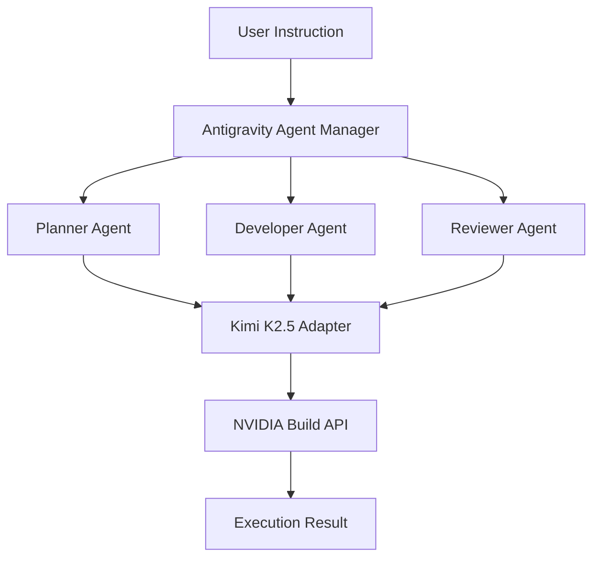

# Antigravity Technical Specification

Antigravity is a multi-agent, vibe-coding platform built on the EigenT framework, using Kimi K2.5 (via NVIDIA endpoints) as its core reasoning engine.

## 1. System Architecture



## 2. Folder Structure

```text
antigravity/
├── config/
│   └── llm_config.py      # Global settings and Key management
├── llm/
│   └── kimi_adapter.py    # OpenAI-compatible wrapper for Kimi K2.5
├── orchestration/
│   └── agent_manager.py   # Multi-task & Parallel execution logic
├── docs/
│   └── technical_spec.md  # System overview
└── tests/                 # Verification scripts
```

## 3. Agent Roles & Responsibilities

| Agent Name | Role | Responsibility |
| :--- | :--- | :--- |
| **Architect** | System Planning | Breaks down high-level vibes into technical plans. |
| **Developer** | Python Coding | Implements logic based on the Architect's plan. |
| **Reviewer** | Code Quality | Validates code against requirements and plan. |

## 4. End-to-End Task Flow (Vibe Coding)

1. **Vibe Input**: User provides a natural language instruction.
2. **Decomposition**: The `Architect` agent generates a structured execution plan.
3. **Parallel Execution**: `Developer` and `Reviewer` agents work in parallel:
   - Developer implements the code.
   - Reviewer generates test cases.
4. **Aggregation**: Results are gathered via `asyncio.gather`.

## 5. Securely Adding API Keys

Antigravity uses environment variables for security. To enable Kimi K2.5, follow these steps:

1. Obtain your API key from [build.nvidia.com](https://build.nvidia.com).
2. Set the environment variable:
   ```powershell
   $env:NVIDIA_API_KEY = "your_key_here"
   ```
3. Restart the orchestrator.

## 6. Switching LLMs in Future

The system is designed with a pluggable adapter layer. To switch LLMs:
1. Create a new adapter in `antigravity/llm/`.
2. Update `Config.LLM_BACKEND` in `config/llm_config.py`.
3. Update `AgentManager` to use the new adapter.

---
**System is ready for API key injection.**
